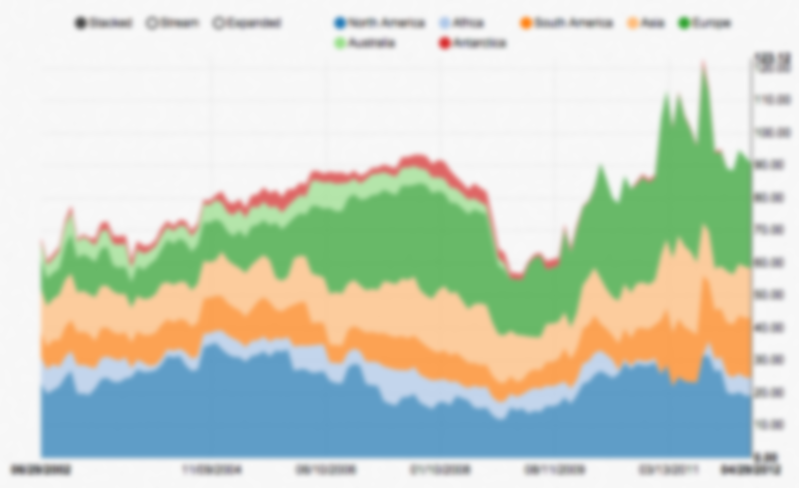
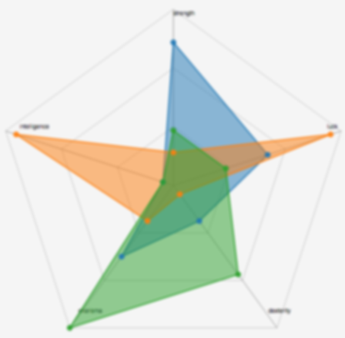

---
layout: default
<!-- permalink: / -->
title: "Luiz Neves"
--- 
<!-- <h1>Main Page</h1> -->

  
 
    <h1>Luiz Neves</h1>
  

  <a class="arrow" href="#About"></a>

  

    

      <h1>Hi, there.</h1>
      
I'm a creative, full-stack web developer.

      

      

        <h2>About Me</h2>
        
As a generalist I use (and learn when necessary) whatever the right tool is for a job. My favorite projects are usually interactive, data-centric, and on the web. I do a lot of scraping, transforming, and visualizing data. I also like opportunities to mix <a href="http://codepen.io/Luiz-N/pen/QwKPOM" target="_blank">technology and art.</a>

      

      

        
      
 
      

        <h2>Details</h2>
        

        <strong>Name:</strong> 
        Luiz Neves 
        <strong>Age:</strong> 
        26 
        <strong>Current Location:</strong> 
        Chicago   

      

    

  
 
  

    
  

  

    

      <h1>Skills</h1>
      
Coming soon...

      

      

        
        
      

    

  

  

    

      <h1>Contact</h1>
      
Want to work on a project together? You can find me here.

      

      

        

          <ul class="no-bullets">
            <li>
              <a href="http://twitter.com/hey_luiz" target="_blank">
                </a>
            </li>
            <li>
              <a href="http://linkedin.com/in/luizneves7/" target="_blank">
                </a>
            </li>
          </ul>
        

        

          <ul class="no-bullets">
            <li>
              <a href="https://github.com/Luiz-N" target="_blank">
                
                </a>
            </li>
            <li>
              <a href="mailto:email@luizneves.com">
                
                
              </a>
            </li>
          </ul>
        

      

      

    

  

<!-- <iframe src='http://koalastothemax.com' frameborder="0"></iframe> -->

<!-- 


  


  --> 
